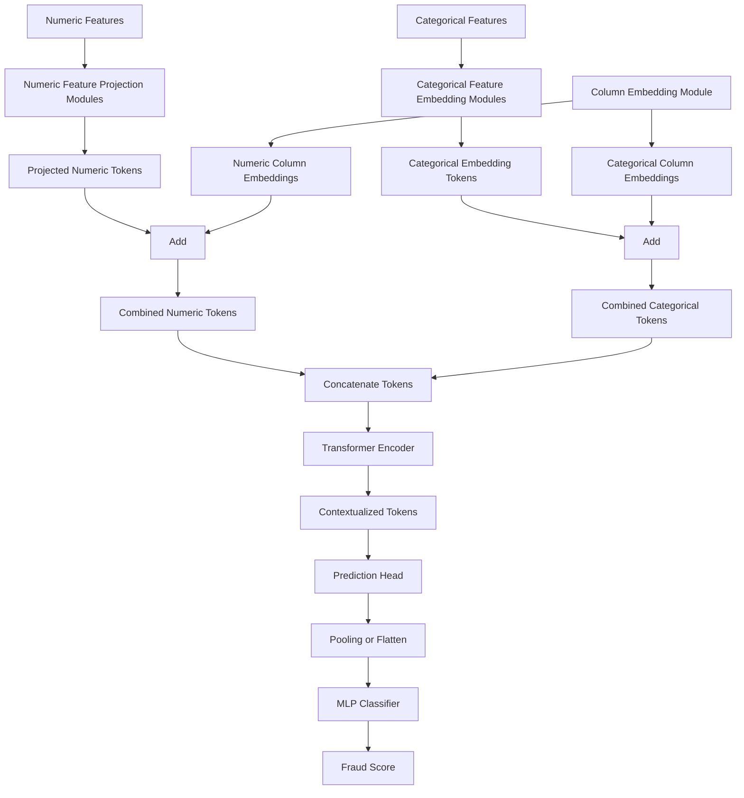

# TabTransformer Model Design

## Goal

Define a TabTransformer-style input architecture for fraud detection with a clear separation between:

- numeric feature projection modules
- categorical feature embedding modules
- column embedding modules
- feature combination logic using the `+` operator
- final feature combination before the transformer encoder

This document focuses on the feature representation stage that prepares tabular columns for downstream transformer blocks and the final prediction head.

The architecture is explicitly separated into:

- input representation modules
- transformer encoder
- prediction head

## High-Level Architecture

The model receives one row of tabular data with:

- `N_num` numeric columns
- `N_cat` categorical columns

Each column is converted into a shared hidden size `d_model` so that all columns can be processed as a sequence of tokens.

```text
Numeric features
  -> NumericFeatureProjection modules
  -> Numeric column tokens

Categorical features
  -> CategoricalFeatureEmbedding modules
  -> Categorical column tokens

Column indices
  -> ColumnEmbedding module
  -> Column identity vectors

Numeric token + numeric column embedding
Categorical token + categorical column embedding
  -> Combined feature tokens

Concatenate all tokens
  -> Tabular token sequence
  -> Transformer encoder
  -> Contextualized tabular representation

Contextualized tabular representation
  -> Prediction head input
  -> Pooling / flattening
  -> MLP head
  -> Fraud probability
```

## Tensor Shapes

Assume:

- batch size: `B`
- hidden size: `d_model`
- number of numeric columns: `N_num`
- number of categorical columns: `N_cat`
- total columns: `N_total = N_num + N_cat`

Main tensors:

- numeric input: `[B, N_num]`
- categorical input: `[B, N_cat]`
- projected numeric tokens: `[B, N_num, d_model]`
- categorical embedding tokens: `[B, N_cat, d_model]`
- numeric column embeddings: `[1, N_num, d_model]`
- categorical column embeddings: `[1, N_cat, d_model]`
- combined numeric tokens: `[B, N_num, d_model]`
- combined categorical tokens: `[B, N_cat, d_model]`
- full token sequence: `[B, N_total, d_model]`

## Module Design

### 1. Numeric Feature Projection Modules

Each numeric column is mapped into the common transformer dimension `d_model`.

### Purpose

- convert scalar numeric values into dense token vectors
- keep each numeric column semantically distinct before transformer mixing
- align numeric features with categorical embeddings in the same latent space

### Recommended design

For numeric column `i`:

```text
x_num[:, i]                 -> [B]
unsqueeze(-1)               -> [B, 1]
Linear(1, d_model)          -> [B, d_model]
LayerNorm(d_model)          -> [B, d_model]
```

Use one projection block per numeric column:

```text
NumericFeatureProjection_i:
  Linear(1, d_model)
  LayerNorm(d_model)
  Optional: GELU
```

Stack all projected columns:

```text
numeric_tokens = stack([
  proj_1(x_num[:, 0]),
  proj_2(x_num[:, 1]),
  ...
  proj_N_num(x_num[:, N_num - 1])
], dim=1)
```

Output:

```text
numeric_tokens: [B, N_num, d_model]
```

### Notes

- per-column projections are preferred over a single shared linear layer because each numeric field has different scale and semantics
- normalization should happen before projection at the dataset or preprocessing level when possible

### 2. Categorical Feature Embedding Modules

Each categorical column uses its own embedding table.

### Purpose

- represent category ids as dense vectors
- preserve per-column categorical semantics
- support high-cardinality columns common in fraud datasets

### Recommended design

For categorical column `j`:

```text
x_cat[:, j]                     -> [B]
Embedding(cardinality_j, d_model)
                                -> [B, d_model]
```

Use one embedding table per categorical column:

```text
CategoricalFeatureEmbedding_j:
  Embedding(num_categories_j, d_model)
```

Stack all embedded columns:

```text
categorical_tokens = stack([
  emb_1(x_cat[:, 0]),
  emb_2(x_cat[:, 1]),
  ...
  emb_N_cat(x_cat[:, N_cat - 1])
], dim=1)
```

Output:

```text
categorical_tokens: [B, N_cat, d_model]
```

### Notes

- reserve one index for unknown or missing categories
- if cardinality is very large, use frequency thresholding or hashing before embedding

### 3. Column Embedding Modules

Column embeddings encode column identity independently from the feature value itself.

### Purpose

- tell the model which token belongs to which source column
- provide a role similar to positional embeddings, but for unordered tabular columns
- allow numeric and categorical tokens to share the same latent space without losing column identity

### Recommended design

Create a learnable embedding table over all feature columns:

```text
ColumnEmbedding:
  Embedding(N_total, d_model)
```

Split the table into:

- numeric column embeddings for indices `[0, N_num - 1]`
- categorical column embeddings for indices `[N_num, N_total - 1]`

Produced tensors:

```text
numeric_column_embeddings      -> [1, N_num, d_model]
categorical_column_embeddings  -> [1, N_cat, d_model]
```

Broadcast over the batch dimension during addition.

## Feature Combination Logic

### 4. Add Projected Numeric Features to Their Column Embeddings

For each numeric column token:

```text
combined_numeric_tokens =
  numeric_tokens + numeric_column_embeddings
```

Shape:

```text
[B, N_num, d_model] + [1, N_num, d_model]
-> [B, N_num, d_model]
```

### 5. Add Categorical Embedding Features to Their Column Embeddings

For each categorical column token:

```text
combined_categorical_tokens =
  categorical_tokens + categorical_column_embeddings
```

Shape:

```text
[B, N_cat, d_model] + [1, N_cat, d_model]
-> [B, N_cat, d_model]
```

### Why the `+` operator is used

Addition is the correct operation here because:

- feature value and column identity should be fused into one token
- the output shape remains `d_model`
- transformer layers expect a uniform token dimension across all columns

Concatenation at this stage would double the feature size and require an extra projection layer to return to `d_model`.

## Final Feature Combination

### 6. Combine Numeric and Categorical Tokens

After adding column embeddings, concatenate numeric and categorical tokens along the token axis:

```text
tabular_tokens = concat(
  [combined_numeric_tokens, combined_categorical_tokens],
  dim=1
)
```

Output:

```text
tabular_tokens: [B, N_total, d_model]
```

This sequence becomes the transformer input.

## Transformer Encoder

The transformer encoder is a standalone component that only contextualizes the combined tabular tokens. It does not include pooling, flattening, or classification.

The combined tokens are processed by stacked transformer encoder blocks.

### Recommended block

```text
TransformerEncoderBlock:
  MultiHeadSelfAttention(d_model, num_heads)
  Add & LayerNorm
  FeedForward(d_model, d_ff)
  Add & LayerNorm
```

Suggested depth:

- `2` to `6` encoder blocks for an initial baseline

Suggested dimensions:

- `d_model`: `32`, `64`, or `128`
- `num_heads`: `4` or `8`
- `d_ff`: `2x` to `4x` `d_model`

### Encoder Input and Output

Input:

```text
tabular_tokens: [B, N_total, d_model]
```

Output:

```text
contextual_tokens: [B, N_total, d_model]
```

The encoder output is the boundary between representation learning and prediction.

## Prediction Head

The prediction head is a separate component that consumes encoder outputs and maps them to fraud logits or probabilities.

For binary fraud detection:

### Option A: Flatten all tokens

```text
[B, N_total, d_model]
-> flatten
-> [B, N_total * d_model]
-> MLP
-> sigmoid / logits
```

### Option B: Pool tokens

```text
[B, N_total, d_model]
-> mean pooling over columns
-> [B, d_model]
-> MLP
-> sigmoid / logits
```

For this project, mean pooling is the simpler default. Flattening can preserve more column-specific detail but increases head size.

### Prediction Head Input and Output

Input:

```text
contextual_tokens: [B, N_total, d_model]
```

Output:

```text
logits: [B, 1]
```

## Forward Pass Summary

```text
Inputs:
  x_num: [B, N_num]
  x_cat: [B, N_cat]

1. numeric_tokens = NumericFeatureProjection(x_num)
2. categorical_tokens = CategoricalFeatureEmbedding(x_cat)
3. numeric_tokens = numeric_tokens + numeric_column_embeddings
4. categorical_tokens = categorical_tokens + categorical_column_embeddings
5. tabular_tokens = concat([numeric_tokens, categorical_tokens], dim=1)
6. contextual_tokens = TransformerEncoder(tabular_tokens)
7. logits = PredictionHead(contextual_tokens)
```

## Mermaid Diagram



## Implementation Notes

- keep numeric and categorical column order fixed across preprocessing, training, and inference
- store categorical vocabulary mappings with the trained model
- include a missing-category index and missing-value handling for numeric inputs
- apply dropout after embeddings or inside transformer blocks, not before basic column identity addition
- start with a single shared `d_model` across all modules

## Recommended Initial Configuration

For a first implementation:

- `d_model = 64`
- `num_heads = 4`
- `num_transformer_layers = 3`
- `feedforward_dim = 128`
- `dropout = 0.1`
- numeric projection: `Linear(1, 64) + LayerNorm(64)`
- categorical embedding: `Embedding(cardinality, 64)`
- column embedding: `Embedding(N_total, 64)`
- pooling: mean pooling inside the prediction head
- output head: `MeanPool -> Linear(64, 32) -> GELU -> Dropout -> Linear(32, 1)`

## Minimal Pseudocode

```python
def forward(x_num, x_cat):
    numeric_tokens = []
    for i, proj in enumerate(self.numeric_projections):
        token = proj(x_num[:, i].unsqueeze(-1))
        numeric_tokens.append(token)
    numeric_tokens = torch.stack(numeric_tokens, dim=1)

    categorical_tokens = []
    for j, emb in enumerate(self.categorical_embeddings):
        token = emb(x_cat[:, j])
        categorical_tokens.append(token)
    categorical_tokens = torch.stack(categorical_tokens, dim=1)

    numeric_tokens = numeric_tokens + self.column_embeddings(self.numeric_column_ids)
    categorical_tokens = categorical_tokens + self.column_embeddings(self.categorical_column_ids)

    tokens = torch.cat([numeric_tokens, categorical_tokens], dim=1)
    contextual_tokens = self.transformer_encoder(tokens)
    logits = self.head(contextual_tokens)
    return logits
```

## Deliverable Scope

This design defines the architecture up to a production-ready implementation boundary. The next implementation step is to convert this document into:

- a model configuration object
- a `TabTransformer` PyTorch module
- dataset-to-tensor preprocessing for numeric and categorical feature splits
